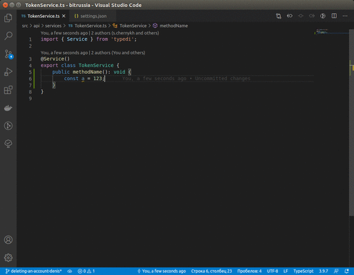

# log-scope-ext README

This is the README for extension "log-scope-ext".

## Features

Formatted scope log extension

## Requirements

## Extension Settings

This extension contributes the following settings:

* `formatted-scope-log.isWithBrackets`: enable/disable brackets around message text. Default `true`
* `formatted-scope-log.logPrefix`: set log prefix (log type), after witch follows `.info` (for `console` - `.log`),`.warn`,`.error`.
Default `this.log`. Possible values (for example): `log`, `console`.

## Known Issues

Perhaps some specific cases are not processed correctly. Please tell me about it.

## Release Notes

### 1.0.0

Initial release

-----------------------------------------------------------------------------------------------------------

## Working with Markdown

**Note:** You can author your README using Visual Studio Code.  Here are some useful editor keyboard shortcuts:

* Split the editor (`Cmd+\` on macOS or `Ctrl+\` on Windows and Linux)
* Toggle preview (`Shift+CMD+V` on macOS or `Shift+Ctrl+V` on Windows and Linux)
* Press `Ctrl+Space` (Windows, Linux) or `Cmd+Space` (macOS) to see a list of Markdown snippets

### For more information

* [Visual Studio Code's Markdown Support](http://code.visualstudio.com/docs/languages/markdown)
* [Markdown Syntax Reference](https://help.github.com/articles/markdown-basics/)

**Enjoy!**
